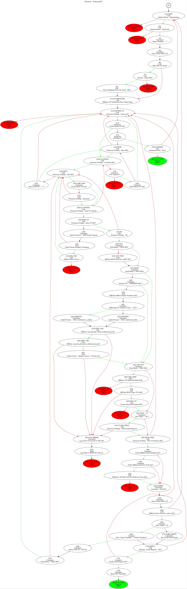

## Usage

```sh
clj -M -m cfg.core putaway-directed-hlf.jpg < putaway-directed-hlf.txt
# or: clj -M -m cfg.core putaway-directed-hlf.txt putaway-directed-hlf.jpg
```

## Example



## TODO

- [ ] here's an idea: so Architect process objects often have empty line comments that delimit sections of logic. You could use those to create clusters. or some other way to incorporate comments. They generally have some meaning to them, and currently we're throwing them away
- [ ] if there's a sequence of actions that don't have differing pass/fail targets, then that can just be one node. Like think about a line of calculate actions in a row. That sometimes happens. You don't need to split those into separate nodes. They can be one node with multiple line number/action labels inside. Maybe use the node label formatting to put a horizontal line separating them. `picking-item-select-wo-hlf` is a good example of this concept - look at the end of the process.
    - if these multi-action nodes end with a flow control branch, then it's assumed the last action in the node determines pass/fail
    - or maybe don't do that ^. A decision node should always be on its own
    - actually, this is more complicated than I thought. What if one of the nodes in the middle of one of these chains is a target of some other node's pass/fail branch? You wouldn't be able to split that. There has to be some graph theory on this. Maybe the idea of *dominator* nodes? But it's still possible
    - if I keep thinking about this and expanding these ideas, I'll eventually just be writing a decompiler :)
    - this ^ is a similar idea to what I was doing for the picking item select rewrite. We had a contiguous stretch of Architect code that we wanted to rewrite as a sproc. So most everything in that stretch was confined (didn't have anything else from before or after pointing to something inside, which would prevent that from being refactored - wouldn't be able to plug in halfway through the sproc). Except I found line 2 could possibly jump to somewhere in the middle of this contiguous stretch. So boom, we had to decrease the length of that stretch to cut off from there on. This is definitely some time of graph theory stuff that I don't know enough about
- [X] A lot of processes have a ton of arrows pointing to a sink node. If a node is a sink node (Return), allow it to be replicated in the graph. So then nodes can point to a sink node that's write next to them, rather than having tons of snaky arrows all over the graph
- [ ] now, to expand the above ^... A lot of nodes point to one node, but it's not necessarily a sink. They should maybe also have a goto graph node? But check this - there's a chance this is already a graphviz thing
